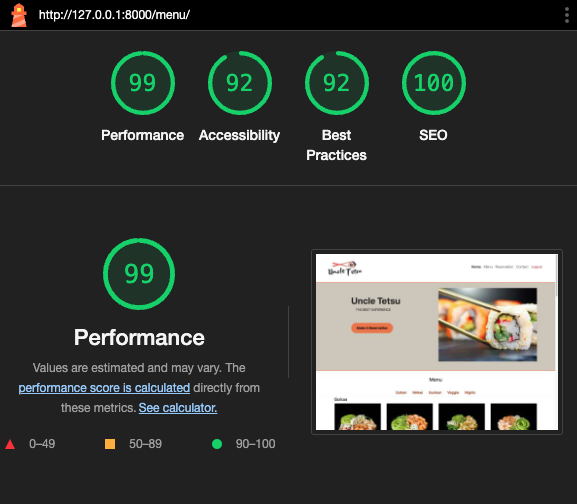
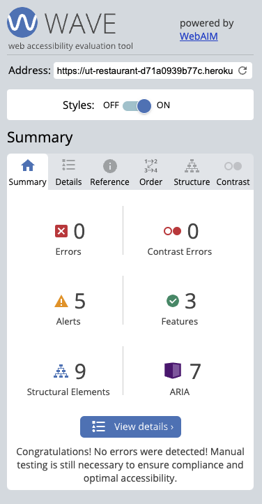
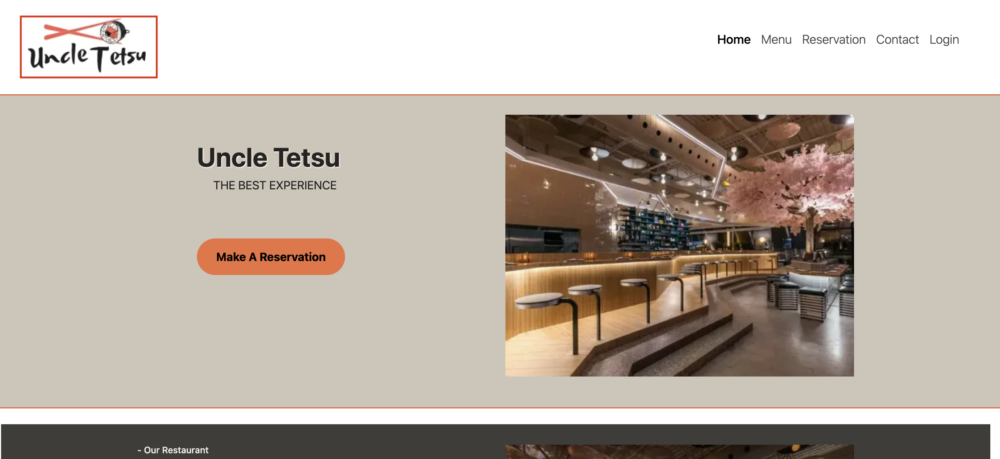

# Uncle Testsu Restaurant

**Developer: *Diego Moro***

[Visit live website](https://ut-restaurant-d71a0939b77c.herokuapp.com/)  
(Ctrl + click to open in new tab)

## Table of Contents
  - [About](#about)
  - [User Goals](#user-goals)
  - [Site Owner Goals](#site-owner-goals)
  - [User Experience](#user-experience)
  - [User Stories](#user-stories)
  - [Design](#design)
    - [Colours](#colours)
    - [Fonts](#fonts)
    - [Structure](#structure)
      - [Website pages](#website-pages)
      - [Database](#database)
    - [Wireframes](#wireframes)
  - [Technologies Used](#technologies-used)
  - [Features](#features)
  - [Validation](#validation)
  - [Testing](#testing)
    - [Manual testing](#manual-testing)
    - [Automated testing](#automated-testing)
    - [Tests on various devices](#tests-on-various-devices)
    - [Browser compatibility](#browser-compatibility)
  - [Bugs](#bugs)
  - [Heroku Deployment](#heroku-deployment)
  - [Credits](#credits)
  - [Acknowledgements](#acknowledgements)

### About

Uncle Tetsu is a fictional business, create for educational purpose. It allows users create an account, book a table, read and write reviews and view the food menu.

### User Goals

- To book a table
- To be able to view and cancel bookings
- To view menus with a descritive ingredients

### Site Owner Goals

- To provide a solution to allow users to book a table online
- Provide a modern application with an easy navigation
- Fully responsive and accessible
- Get User's review for improvement

## User Experience

### Target Audience
- **Food Enthusiasts:** Individuals who are passionate about trying new foods and exploring different cuisines.
- **Social Diners:** Friends and families looking for a convenient way to make restaurant reservations and enjoy a meal together.
- **Review Contributors:** Users who enjoy sharing their dining experiences with others. They like to write reviews about the restaurants they visit and read reviews from fellow diners to make informed decisions.
- **Local Explorers:** Residents of the area where Uncle Tetsu is located who are interested in discovering local eateries and supporting businesses in their community.

### User Requirements and Expectations

* Fully responsive Design
    * Users expect the website to be accessible and usable across a variety of devices, including desktops, tablets, and smartphones.
    

* Accessibility
    * The website should adhere to accessibility standards, making it easy to navigate and use for individuals with disabilities.
    

* A welcoming and Inviting Design
    * Users want a visually appealing and welcoming design that reflects the restaurant's ambiance and culinary identity.
    

* Social Media Integration
    * Users expect easy access to the restaurant's social media profiles to stay updated with the latest news, offers, and events.
    

* Contact information
    * Users need clear and accessible contact information, including the restaurant's address, phone number, and email.
    

* Comprehensive Food Menu
    * Each menu item should include descriptions, images, and pricing information for informed decision-making.
    

* Easy Reservation Process
    * Users anticipate a straightforward process to book a table. This includes selecting the date, time, number of guests, and any special requests.
    

* User Reviews and Ratings
    * Users want to read reviews and ratings from other diners to gauge the quality of the dining experience.
    

##### Back to [top](#table-of-contents)

## User Stories

### Users

1. Being a User, I am able to have easy navigation in order to move to each feature of the site.
2. Being a User, I am able to see dish information(description, image and price) in order to make an informed decision.
3. Being a User, I am able to easily find the address and location in order to view in a map the directions.
4. Being a User, I am able to find contact information and opening hours in order to know when the business is open and how to contact via phone or email.
5. Being a User, I am able to find social media icons in order to follow the business social medias.
6. Being a User, I am able to write reviews, and rating in order to share my experience with others.
7. Being a User, I am able to edit or delete an existing review in order to update and provide my experience.
8. Being a User, I am able to sign in/sign up in order to make reservation and write reviews.
9. Being a User, I am able to make a reservation in order to to take a table for the chosen date, time and number of guests.
10. Being a User, I am able to see reservation details in order to to accept or delete my reservation.

### Admin / Authorised User

11. Being a Admin, I am able to manually make reservation in order to make reservation when a costumer calls or contact via social medias.
12. Being a Admin, I am able to authenticate and log into the admin dashboard in order to manage users informations, reservations history and reviews.
13. Being a Admin, I am able to manage menu items in order to add, delete menu items details.
14. Being a Admin, I am able to have access to the user reviews in order to manage and moderate all reviews.
15. Being a Admin, I am able to filter registered users by name, staff status, superuser status in order to easily find a specific user or staff member contact.
16. Being a Adimin, I am able to filter reservation in order to easily see a reservation by date, author or if reservation is cancelled.
17. Being a Admin, I am able to view a list of all reservations made by users in order to I can manage all reservations.

### Site Owner

18. Being a Site Owner, I can provide fully responsive site for my costumers in order to have a good experience.
19. Being a Site Owner, I can provide an intuitive and descritive menu with description, pictures and price for my costumers in order to have a informed decision-making.

### Kanban, Epics & User Stories
- GitHub Kanban was used to track all open user stories
- Epics were created using the milestones feature
- Backlog, In Progress, Done headings were used in the kanban

Epics

User Stories

Kanban

##### Back to [top](#table-of-contents)

## Design

### Colours

In the process of craftingthe visual identity, I selected meticulously selected a palette of colors that encapsulate the essence of the brand. Each color holds a purpose and contributes to the overall aesthetic we wish to convey.

The colors I wanted to stay close to  [Coolors.co](https://coolors.co/)

See colour pallet

### Fonts

 None font were selected using the default system font "Helvetica".

 ### Structure

#### Website pages

The site was designed for the user to be familiar with the layout such as a navigation bar along the top of the pages and a hamburger menu button for smaller screen.

The footer contains all relevant social media links that the business has so the user can visit any social media site and follow the business there to expand the businesses followers, likes and shares.

* The sites consists of the folloowing pages:
    * **Home page** with a main banner that contains caroussel of pictures, a button that takes user to make a reservation and also the review section.
    * **Menu page** that also contains the main banner, a navbar that displays the differents categories of the dishes, images of the dishes in or menu and a description with price for each option when the cursor is over the image.
    * **Reservation page** that has a form where user can fill to book a table with personal information and choose date, time, number of guests and also leave a message.
    * **Contact Us page** contains the business contact informations such as phone number and email, address and a map link.
    * **Edit Review** for those logged user that want to edit their reviews, the page contains a message field and rating.
    * **Login / Logout** allows users to login to make bookings, view, edit, and delete bookings
    * **Register** allows the user to regiser so they can use the booking system and write reviews.
    * **Error page** to display if a 403, 404 500 error is raised.

#### Database
Built with Python and the Django framework with a database of a Postgres for the deployed Heroku version(production)

Show diagram

##### User Model
* The User Model contains the following:
    * id
    * username
    * name
    * email
    * phone
    * groups
    * user_permissions
    * is_staff
    * superUser
  

##### User Reviews Model
* The User Reviews Model contains the following:
    * id
    * author
    * comment
    * rating
    * created
    * approved
    * status
    * slug

##### Reservation Model
* The Reservation Model contains the following:
    * id
    * user
    * name
    * email
    * phone
    * numGuests
    * date
    * time
    * message
    * is_cancelled

##### Menu Model
* The Menu Model contains the following:
    * id
    * category
    * name
    * price
    * image
    * slug

##### User Login Forms
* The User Login Forms contains the following:
    * id
    * username
    * password

##### User Registration Form
* The User Registration Form contains the following:
    * id
    * username
    * password

### Wireframes
The wireframes were created using Miro

Home

Menu

Reservation

Contact Us

Login

## Technologies Used

### Languages & Frameworks

* HTML
* CSS
* Javascript
* Python
* Django

### Libraries & Tools

- [Website Mockup Generator](https://websitemockupgenerator.com/)
- [Miro](https://miro.com/)
- [Bootstrap v4.6](https://getbootstrap.com/)
- [Cloudinary](https://cloudinary.com/)
- [Favicon.io](https://favicon.io)
- [Chrome dev tools](https://developers.google.com/web/tools/chrome-devtools/)
- [Font Awesome](https://fontawesome.com/)
- [Git](https://git-scm.com/)
- [GitHub](https://github.com/)
- [Google Fonts](https://fonts.google.com/)
- [Heroku Platform](https://id.heroku.com/login)
- [jQuery](https://jquery.com)
- [Postgres](https://www.postgresql.org/)
- [Summernote](https://summernote.org/)
- Validation:
  - [WC3 Validator](https://validator.w3.org/)
  - [Jigsaw W3 Validator](https://jigsaw.w3.org/css-validator/)
  - [JShint](https://jshint.com/)
  - [Pycodestyle(PEP8)](https://pypi.org/project/pycodestyle/)
  - [Lighthouse](https://developers.google.com/web/tools/lighthouse/)
  - [Wave Validator](https://wave.webaim.org/)

##### Back to [top](#table-of-contents)

## Features

### Home page
- Home page includes nav bar, main body and a footer

See feature images

### Main Banner
- Contains a button that link users to reservation page.
- Runs a caroussel of images

See feature images

### Logo & Navigation
- Custom logo for the business
- Fully Responsive
- On small screens switches to hamburger menu
- Indicates login/logout in status
- displayed on all pages

See feature images

### Reviews
- Contains a lista of reviews made by logged user
- There are edit and delete button 

See feature images

### Write Review
- Contains a message field and a rating button that user can choose scale 1 to 5
- Button to submit a review

See feature images

### Edit Review
- Contains a message field and a rating button that user can choose scale 1 to 5
- Button to save the changes

See feature images

### Footer
- Contains social media links and copyright
- Logo that link to Homepage

See feature images

### Menu 
- Contains category Navbar
- Contains image items, with name, description and price

See feature images

### Reservation 
- Contains a Form with phone nunmber, nunber of guests, date, time and text field
- Contains business contact information such as phone number and email

See feature images

### Reservation details
- Contains details of a made reservation
- Contains a Done button that send user to HomePage and a Delete button that delete the existing reservation

See feature images

### Contact Us
- Contains opening hours, address and contact information such as phone number and Email.
- Displays a clickable map that show routes to the restaurant 

See feature images

### Login
- Contains button to sign in with social media
- Contains a form to with username and password field
- Contains a link to register page

See feature images

### Register
- Contains button to  sign up with social media
- Contains a form to with username, password and password confirmation field
- Contains a link to sign in page

See feature images

##### Back to [top](#table-of-contents)

## Validation

The W3C Markup Validation Service

Home

Menu

Reservation

Contact Us

Login

Register

Edit Review

Reservation Detail

403

404

500

### CSS Validation
The W3C Jigsaw CSS Validation Service

Style.css

### JavaScript Validation
JSHint JS Validation Service

Script.js

### PEP8 Validation
PEP8 Validation Service was used to check the code for PEP8 requirements via Pycodestyle

Tool used: Pycodestyle

### Performance

Google Lighthouse in Google Chrome Developer Tools was used to test the performance of the website.

#### Home

Desktop and Mobile

#### Menu

Desktop and Mobile

#### Reservation

Desktop and Mobile

#### Contact Us

Desktop and Mobile

#### Log In

Desktop and Mobile

#### Register

Desktop and Mobile

#### Edit Review

Desktop and Mobile

### Accessibility
The WAVE WebAIM web accessibility evaluation tool was used to ensure the website met high accessibility standards. All pages pass with 0 errors.

Home

Menu

Reservation

Contact Us

Log in

Register

Edit Reviews

Error

## Testing

### Manual testing

1. Being a User, I am able to have easy navigation in order to move to each feature of the site.

**Step** | **Expected Result** | **Actual Result**
------------ | ------------ | ------------ |
| Click on the 'Home' link in the navigation bar | Homepage will load| Works as expected |
| Click on the 'Menu' link in the navigation bar | Menu page will load| Works as expected |
| Click on the 'Reservation' link in the navigation bar | Reservation page will load| Works as expected |
| Click on the 'Contact Us' link in the navigation bar | Contact Us page will load| Works as expected |
| Click on the 'Login' link in the navigation bar | Login menu page will load| Works as expected |
| Click on the 'Logo' link in the navigation bar | Homepage page will load| Works as expected |

Manual testing 1

 
2. Being a User, I am able to see dish information(description, image and price) in order to make an informed decision.

**Step** | **Expected Result** | **Actual Result**
------------ | ------------ | ------------ |
| At menu page | a list of images for the dishes | Works as expected |
| At menu page hover over the pictures | Name, description and price of the dishe| Works as expected |

Manual testing 2

 

3. Being a User, I am able to easily find the address and location in order to view in a map the directions.

**Step** | **Expected Result** | **Actual Result**
------------ | ------------ | ------------ |
| At Contact page | Full address is displayed ate the top of the page | Works as expected |
| At Contact page | a clickable map shows the address | Works as expected |

Manual testing 3

 

4. Being a User, I am able to find contact information and opening hours in order to know when the business is open and how to contact via phone or email.

**Step** | **Expected Result** | **Actual Result**
------------ | ------------ | ------------ |
| At Reservation page | a clickable Phone number and e-mail contact | Works as expected |
| At Contact page | a clickable Phone number and e-mail contact | Works as expected |

Manual testing 4

 

5. Being a User, I am able to find social media icons in order to follow the business social medias.

**Step** | **Expected Result** | **Actual Result**
------------ | ------------ | ------------ |
| On footer t the bottom of all pages | Links send users to the business social medias | Works as expected |

Manual testing 5

 

6. Being a User, I am able to write reviews, and rating in order to share my experience with others.

**Step** | **Expected Result** | **Actual Result**
------------ | ------------ | ------------ |
| At Home page click on the button "Send a Review" on Reviews section | Text field, rating 1 to 5 option and a button to submit | Works as expected |

Manual testing 6

 

7. Being a User, I am able to edit or delete an existing review in order to update and provide my experience.

**Step** | **Expected Result** | **Actual Result**
------------ | ------------ | ------------ |
| At Home page, reviews section click on the button "edit" | Text field, rating 1 to 5 option and a button to submit | Works as expected |
| At Home page, reviews section click on the button "delete" | Text field, rating 1 to 5 option and a button to submit | Works as expected |

Manual testing 7

 

8. Being a User, I am able to sign in/sign up in order to make reservation and write reviews.

**Step** | **Expected Result** | **Actual Result**
------------ | ------------ | ------------ |
| At Log In page | A form to for user be able to insert username and password to log in | Works as expected |
| At Log In page, under the for has a link to send user to register page | A form for the users to insert personal details to resgister to the site | Works as expected |

Manual testing 8

 

9. Being a User, I am able to make a reservation in order to to take a table for the chosen date, time and number of guests.

**Step** | **Expected Result** | **Actual Result**
------------ | ------------ | ------------ |
| At Reservation page | A form for the user make a reservation | Works as expected |
| At Home page, click on the button Make A Reservation in the main banner | A form for the user make a reservation | Works as expected |
| At Menu page, click on the button Make A Reservation in the main banner | A form for the user make a reservation | Works as expected |

Manual testing 9

 

10. Being a User, I am able to see reservation details in order to to accept or delete my reservation.

**Step** | **Expected Result** | **Actual Result**
------------ | ------------ | ------------ |
| At Reservation page for users that already have a reservation | All the existing reservation details | Works as expected |
| Just after make a reservation,  | All the existing reservation details | Works as expected |

Manual testing 10

 